# 01 大模型简介

## 目录

-   [1.何为大模型](#1何为大模型)
    -   [语言模型进化史](#语言模型进化史)
-   [2.大模型特点是什么](#2大模型特点是什么)
-   [3.流行的大模型](#3流行的大模型)
    -   [闭源LLM](#闭源LLM)
    -   [开源LLM](#开源LLM)
-   [4.LangChain](#4LangChain)
    -   [什么是LangChain](#什么是LangChain)
    -   [LangChain的模型](#LangChain的模型)
    -   [LangChain核心组件](#LangChain核心组件)

## 1.何为大模型

大规模语言模型（Large Language Models，LLM），也称大语言模型 或大型语言模型 ，是一种由包含数百亿以上参数的深度神经网络构建的语言模型，通常使用自监督学习方法通过大量无标注文本进行训练。

说到大语言模型，首先介绍语言模型（Language Model，LM），目标是建模自然语言的概率分布，表示如下：

$P(w_1,...,w_L)$

### 语言模型进化史

-   信息论、熵

    熵：度量概率分布

    $\begin{aligned}H(p)=\sum_xp(x)\log \frac{1}{p(x)}\end{aligned}$

    熵的值越小，表明序列的结构性越强。
-   N-gram语言模型

    在一个N-gram语言模型中，关于$x_i$的预测只依赖于最后的$n-1$个字符$x_{i-(n-1):i-1}$，即：

    $p(x_i|x_{1:i-1})=p(x_i|x_{i-(n-1):i-1})$

    例如：$p(cheese|the,mouse,ate,the)=p(cheese|ate,the) \ \ \ \  (n=3)$

    n 元语言模型仍然有几个较为明显的缺点：（1）无法建模长度超过 n 的上下文；（2）依赖人工设计规则的平滑技术；（3）当 n 增大时，数据的稀疏性随之增大，模型的参数量更是指数级增加，并且模型受到数据稀疏问题的影响，其参数难以被准确的学习；（4）n 元文法中单词的离散表示也忽略了单词之间的相似性。

基于神经网络的语言模型逐渐成为了研究热点。

-   Word2Vec

    这是一个神经语言模型，可以计算单词的连续向量表示，用于从巨大的数据集中学习高质量的单词向量。

    Word2Vec训练模型本质上是**只具有一个隐含层的神经元网络**，输入是采用**One-hot编码**的词汇表向量，输出也是One-hot编码的词汇表向量。但是根据输入输出的不同，主要分为CBOW和skip-gram模型。

    训练完毕后，输入层的每个单词与矩阵W相乘得到的向量的就是我们想要的词向量，也叫做word embedding。对应的每个词的词向量表示便是输入层到隐含层的权重$W_{V\times N}$第 i 行的转置。

    CBOW模型通过上下文的内容预测中间的目标词，

    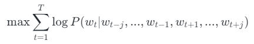

    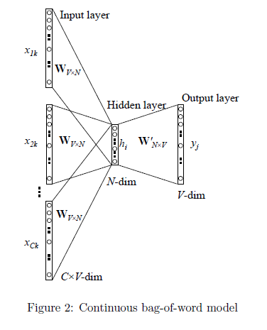

    Skip-gram通过目标词预测其上下文的词，

    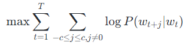

    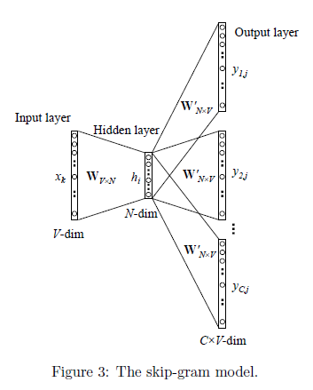

    Word2Vec也有很大的缺陷，由于词和向量是一对一的关系，所以多义词的问题无法解决；此外，Word2vec是一种静态的方式，虽然通用性强，但是无法针对特定任务做动态优化。
-   ELMo

    ELMo的模型结构如下：

    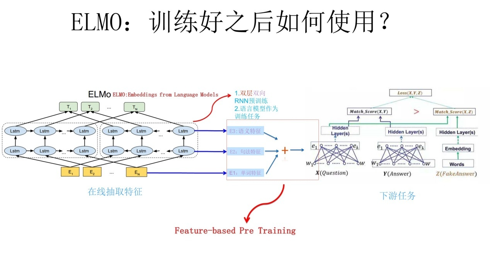

    预训练阶段是基于双层双向LSTM的模型，训练好该网络后，输入一个新的句子，句子中每个单词都能得到对应的**三个Embedding**:**最底层是单词的 Word Embedding，往上走是**第一层双向LSTM中对应单词位置的 Embedding，这层编码单词的**句法信息**更多一些；再往上走是**第二层LSTM中对应单词位置的 Embedding**，这层编码单词的**语义信息**更多一些。

    与Word2Vec相比，ELMo主要解决了多义词的问题。在ELMo中，预训练好的模型不再只是向量对应关系，而是一个训练好的模型。使用时，将一句话或一段话输入模型，模型会根据上下文来推断每个词对应的词向量，这样可以结合上下文语境对多义词进行理解。

    但仍存在一些缺点：双向LSTM是串行机制，训练速度慢，双向LSTM是对不同层参数采用拼接的方法用于下游任务，特征选择和融合较弱等问题。
-   Transformer

    Transformer是一种**序列到序列的神经网络架构**，不同于CNN和RNN模型，整个网络结构完全是由Attention机制组成。网络结构如下：

    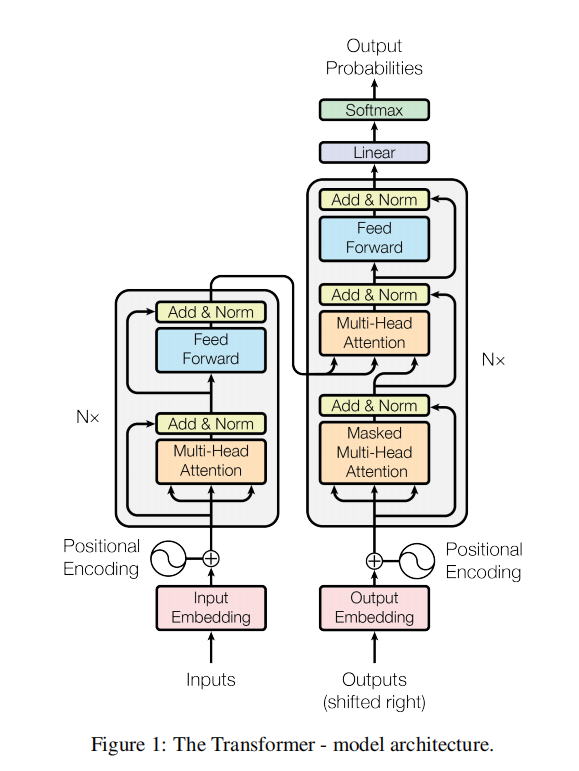

    网络结构方面：Transformer是一种**序列到序列**的神经网络框架，其由编码器和解码器两部分组成，
    -   编码器

        编码器由多头注意力层，前馈神经网络层，一个残差连接和层归一化组成。通过多头注意力层来计算序列中不同单词之间的关系，例如，在处理一个词时，Attention使模型能够专注于输入中该词密切相关的其他词。
    -   解码器

        解码器先是包含一个自注意力层前馈层，由残差连接和层归一化组成，这一部分自注意力层是mask multi-head attention，目的是在解码阶段，防止模型利用未来信息，造成信息泄漏；其次是一个编码器-解码器注意力层，该层可以将输入序列的不同位置的信息集成到解码器的当前位置，提高解码器对输入序列的理解能力，在生成过程中帮助解码器能够更好地理解上下文。
        这里讲下为什么采用Attention机制，RNN算法的计算是串行的，只能从左向右或从右向左依次计算，这种机制存在两个问题：
    1.  时间片 t 的计算依赖t-1时刻的计算结果，这样限制了模型的并行能力；
    2.  顺序计算的过程中信息会丢失，尽管LSTM等门机制的结构一定程度上缓解了长期依赖的问题，但是对于特别长期的依赖现象，LSTM依旧无能为力。
        而Attention机制，可以将序列中任意两个位置之间的距离缩小为一个常量，使模型不再具有长程依赖问题；并且基于其自身结构特性，具有更好的并行性。
    当然，Transformer模型也有很多缺点，如果输入是一个长文本序列，输入时需要将其截断为几百个字符的固定长度片段，再分别进行编码，这样的话，片段之间没有任何信息交互。所以：
    -   Transformer**无法建模超过固定长度的序列**的依赖关系，对**长文本编码效果差**；
    -   Transformer将要处理的文本分割成等长片段，这样就导致**上下文碎片化**，就可能导致**重要的上下文信息被分割成多个碎片**；
    -   在推理阶段，由于解码器本身的特性，会导致**计算量非常大**。
-   Bert

    BERT是基于Transformer的双向编码器表示的预训练模型，结构如下：

    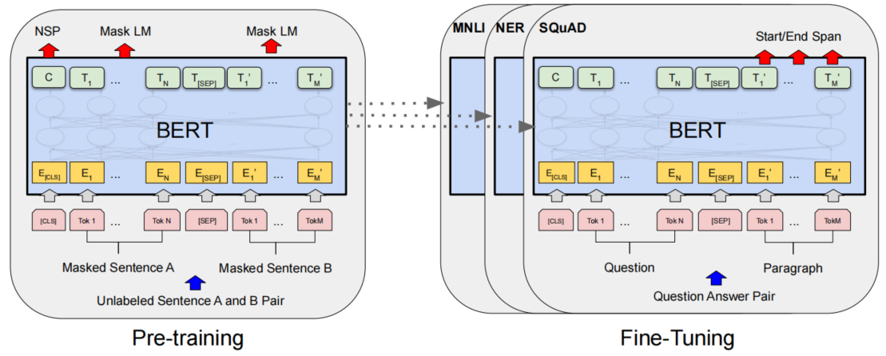

    在Bert框架中，主要包含两部分：预训练和微调
    -   预训练

        **预训练过程**中，该模型在不同的预训练任务上对未标记的数据进行训练。Bert模型架构是一个多层双向Transformer编码器，与GPT相比，**Bert是双向自注意机制**，可以更好地编码上下文信息，而**GPT只关注左侧的上下文**。

        Transformer的输入：token embeddings 和 positional embeddings

        Bert模型的输入：token embedding、位置嵌入positional embedding和sentence embedding。

        sentence embedding：添加了一个 **\[SEP]标记**来标记句子的结尾，并添加了一个句子嵌入(每个句子的嵌入是恒定的，但两个句子之间不同)。这使得模型可以很容易地确定一个句子的结尾和另一个句子的开始，并为不同的句子赋予不同的含义。

        为了允许分类任务，作者在输入序列的开头添加了一个 **\[CLS] 标记**，仅在分类时使用。

        

        使用两个无监督的任务对BERT**同时**进行预训练，*Masked Language Model\_和\_Next Sentence Prediction*，

        Task1：**Mask LM**, 简单地**随机屏蔽一些百分比的输入标记**（本文15%）**，然后预测这些掩蔽标记**。我们将这个过程称为“掩码语言模型”（MLM）。虽然这允许我们获得一个双向的预训练模型，但缺点是在预训练和微调之间创建了一个不匹配，因为\[MASK]Token在微调期间不会出现。为了缓解这种情况，关于如何构建MASK-LM的训练样本，BERT采用了如下Trick：

        （1）随机遮盖掉整个输入序列15%的token（不遮盖特殊token，如\<cls>和\<sep>）

        （2）选定好需要遮盖的token后，对这个token的处理方式如下：
        -   80%的概率，将token替换为特殊符号\<MASK>
        -   10%的概率，将token随机替换为vocabulary中的某个token
        -   10%的概率，保持原token不变
            **为什么要以一定的概率去改造token，而不是统一给这些选中被遮盖的token一个\<mask>标记呢？**
        这是因为，一来，在之后的**fine-tuning阶段**，数据集中**不会出现这些人造的\<mask>标记**，这就造成预训练的数据集和fine-tuning的数据集不匹配的情况。二来，通过将token进行随机替换，给模型增加噪声，使得模型的泛化能力更强。

        Task2：**Next Sentence Prediction，许多重要的下游任务，如问答（QA）和自然语言推理（NLI），都是基于对两个句子之间的关系的理解，而这并不是由语言建模直接捕获的。为了训练一个**能够理解句子关系的模型，预测输入的两个句子是否是真实相连的两个句子（二元分类）。而此处的embedding，就是要抽取出和此分类相关的足够多的信息。具体步骤如下：

        （1）对输入的句子对进行随机替换
        -   50%的概率，两个句子真实相连
        -   50%的概率，第二个句子是从训练数据集中随机挑选的句子
            （2）将过BERT层抽出的 embedding送入Next Sentence Prediction Model，这也是一个简单的Linear nn。
    -   Fine-tuning

        微调过程，首先使用预先训练好的参数初始化BERT模型，并使用从下游任务中获得的标记数据对所有参数进行微调。每个下游任务都有单独的微调模型，即使它们是用相同的预训练参数初始化。对于每个任务，我们只需将特定于任务的输入和输出插入BERT，并端到端调整所有参数。在输入时，预训练中的句子A和句子B类似于(1)释义中的句子对，(2)隐含中的假设-前提对，(3)问答中的问题-段落对，以及(4)文本分类或序列标记中的退化text-∅对。在输出时，令牌表示被输入输出层用于标记级任务，如序列标记或问题回答，\[CLS]表示被输入输出层进行分类，如隐含或情绪分析。
-   GPT

    GPT是基于Transformer解码器结构的自回归语言模型，也是现在主流大语言模型的结构。

    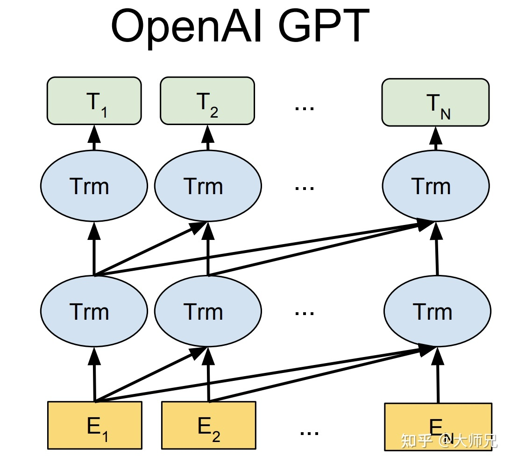

    GPT的训练流程也主要包括两部分，无监督预训练+微调：
    -   无监督预训练

        将**语言建模**任务作为训练目标，就是根据已知的词预测未知的词。在这里设定一定的窗口大小，即根据有限的词预测下一个词，给定一个语料的句子序列$U = \{u_1,…,u_n\}$，已知前$k$个词预测当前词$u_i$，使用标准语言建模目标来最大化以下可能性:

        $L_1(u)=\sum_i log P(u_i|u_{i-k},...,u){i-1};\Theta)$

        其中$k$是上下文窗口的大小，条件概率$P$是使用参数为$Θ$的神经网络建模的。

        如何编码前$k$个词成一个向量，也就是如何计算$P$？

        使用Transformer的多个Decoder，取最后一个Decoder的输出作为前$  k  $个窗口词的表示向量(也就是预测词的嵌入向量)，将其进行softmax得到所有词的概率分布，将其与真实标签作损失：

        $ \begin{aligned} h_0&=UW_e+W_p\\h_l&=transformer block(h_{l-1})\forall \in [1,n] \\P(u)&=softmax(h_n W_e^T)
        \end{aligned}  $

        其中$U$是上下文token对应的embedding向量，$n$是层数，$W_e$是token embedding矩阵，$W_p$是position embedding矩阵。 &#x20;
    -   有监督微调

        给定一个有监督任务的数据集C ：给定输入序列$ x1,x2,...,xm  $, 预测标签 $y$

        经过预训练之后，得到优化后的Decoders的参数，将Decoders作为下游任务的表示编码器，在Decoers之后再接一层 softmax预测分类任务的标签

        取最后一个Decoder的输出所有输出 $ℎ^m_l$作为嵌入表示，输入到 softmax中进行标签概率预测：

        $\begin{aligned} P(y|x_1,...,x_m)&=softmax(h_l^mW_y)\\L_2(C)&=\sum_{(x,y)}log P(y|x_1,...,x_m)\end{aligned}$

## 2.大模型特点是什么

随着大语言模型的发展，在多方面已经取得重要进展：

1.  **巨大的规模：** LLM通常具有巨大的参数规模，可以达到数十亿甚至数千亿个参数。这使得它们能够捕捉更多的语言知识和复杂的语法结构。
2.  **预训练和微调：** LLM采用了预训练和微调的学习方法。它们首先在大规模文本数据上进行预训练（无标签数据），学会了通用的语言表示和知识，然后通过微调（有标签数据）适应特定任务，从而在各种NLP任务中表现出色。
3.  **上下文感知：** LLM在处理文本时具有强大的上下文感知能力，能够理解和生成依赖于前文的文本内容。这使得它们在对话、文章生成和情境理解方面表现出色。
4.  **多语言支持：** LLM可以用于多种语言，不仅限于英语。它们的多语言能力使得跨文化和跨语言的应用变得更加容易。
5.  **多模态支持：** 一些LLM已经扩展到支持多模态数据，包括文本、图像和声音。这意味着它们可以理解和生成不同媒体类型的内容，实现更多样化的应用。
6.  **多领域应用：** LLM已经被广泛应用于文本生成、自动翻译、信息检索、摘要生成、聊天机器人、虚拟助手等多个领域，对人们的日常生活和工作产生了深远的影响。
7.  **涌现能力：** LLM表现出令人惊讶的涌现能力，即在大规模模型中出现但在小型模型中不明显的性能提升。这使得它们能够处理更复杂的任务和问题。

在取得重要进展的同时，大模型也存在一些挑战性的问题待解决：

1.  **伦理和风险问题：** 尽管LLM具有出色的能力，但它们也引发了伦理和风险问题，包括生成有害内容、隐私问题、认知偏差等。因此，研究和应用LLM需要谨慎。
2.  **幻觉**：在生成事实文本时，一个具有挑战性的问题是幻觉生成 ，即，生成的信息与现有来源相冲突（内在幻觉）或无法通过现有来源验证（外在幻觉）。幻觉会误导 LLM 生成非预期的输出，并且在大部分时候会降低其性能，为部署LLM 到实际应用带来潜在风险。
3.  **知识实时性**：需要使用比训练数据更新的知识的任务时，LLM 在解决这些任务时会遇到困难。并且，微调 LLM 的成本非常昂贵的，增量训练LLM 非常可能导致灾难性遗忘问题。
4.  **安全性**：⼤型语⾔模型目前是基于公共互联⽹的抓取进⾏训练的，这意味着任何⼈都可以建⽴⼀个可能进⼊训练数据的网站。从安全⻆度来看，这是⼀个巨⼤的安全漏洞。
5.  **法律考虑**：大模型的训练数据中也有很多版权数据，对于模型生成内容的版权性争议很大。
6.  **社会偏见**：在不同人群之间存在性能差异。

## 3.流行的大模型

### 闭源LLM

1.  OpenAI公司的GPT系列

    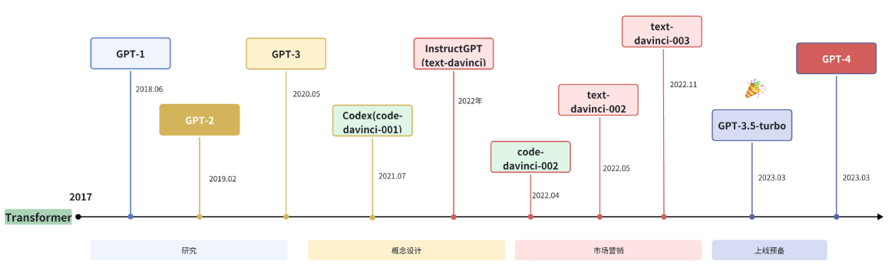

    ChatGPT ：现在的 ChatGPT 支持最长达 32,000 个字符，知识截止日期是 2021 年 9 月，它可以执行各种任务，包括**代码编写、数学问题求解、写作建议**等。ChatGPT 在与人类交流方面表现出了卓越的能力：拥有丰富的知识储备，对数学问题进行推理的技能，在多回合对话中准确追踪上下文，并且与人类安全使用的价值观非常一致。

    GPT-4：最新的GPT-4现已支持128k 上下文窗口，知识更新到2023年4月，在ChatGPT的基础上，现已支持**多模态**任务，包括视觉、图像生成（DALL·E 3）和文本转语音（TTS）等。并且**在综合能力方面的确更出色**，尤其是**逻辑、推理**等方面，能力更出色、更强大。

    使用地址：[https://chat.openai.com/](https://chat.openai.com/ "https://chat.openai.com/")
2.  Anthropic 公司的Claude系列

    Claude2：上下文窗口已经扩展到 200K token，从而提供更多上下文和改进的响应。可以完成摘要总结、搜索、协助创作、问答、编码等任务，在法律、数学和编码等领域表现出色，并在标准化考试中获得高分。它还关注安全和道德，使其不太可能显示危险内容。

    使用地址：[https://claude.ai/chats](https://claude.ai/chats "https://claude.ai/chats")
3.  Google公司的PaLM系列

    PaLM 2 ：在多语言文本方面接受了更多的训练，涵盖了 100 多种语言，对于理解、生成和翻译包括成语、诗歌和谜语在内的细微差别文本的能力非常显著，还通过了“精通”级别的高级语言能力考试。

    使用地址：[https://ai.google/discover/palm2/](https://ai.google/discover/palm2/ "https://ai.google/discover/palm2/")
4.  百度公司的文心一言系列

    使用地址：[https://yiyan.baidu.com/](https://yiyan.baidu.com/ "https://yiyan.baidu.com/")
5.  科大讯飞公司的星火大模型系列

    使用地址：[https://xinghuo.xfyun.cn/](https://xinghuo.xfyun.cn/ "https://xinghuo.xfyun.cn/")

### 开源LLM

1.  LLaMA系列

    **LLaMA 系列模型**是 Meta 开源的一组参数规模 **从 7B 到 70B** 的基础语言模型，在数万亿个字符上训练，展示了如何**仅使用公开可用的数据集来训练最先进的模型**，而不需要依赖专有或不可访问的数据集。数据集包括 Common Crawl、Wikipedia、OpenWebText2、RealNews、Books 等。LLaMA 模型使用了**大规模的数据过滤和清洗技术**，以提高数据质量和多样性，减少噪声和偏见。LLaMA 模型还使用了高效的**数据并行**和**流水线并行**技术，以加速模型的训练和扩展。

    开源地址：[https://github.com/facebookresearch/llama](https://github.com/facebookresearch/llama "https://github.com/facebookresearch/llama")
2.  GLM系列

    GLM系列模型是清华大学和智谱 AI 等合作研发的开源语言大模型。

    模型结构方面，GLM 采用了**二维位置编码**，第一维表示当前位置的原文本中的位置信息，第二维表示对应的掩码的位置信息。

    模型训练方面，GLM 采用了**自回归填空**作为预训练任务，并且使用多任务预训练的方式提升模型生成长文本的能力和序列到序列任务的能力。

    ChatGLM 是基于 GLM 结构开发的具有 **62 亿参数量**的语言大模型，**支持 2048 的上下文长度**。其使用了包含 1 万亿字符的中英文语料进行训练，能够**支持中文和英文两种语言的任务**。

    ChatGLM 2使用了包含 **1.4 万亿字符的中英预料进行预训练，并使用人类偏好的数据对模型进行对齐训练**，**支持的长下文长度达到了 3.2 万字符**，在多个任务上取得提升。

    开源地址：[https://github.com/THUDM](https://github.com/THUDM "https://github.com/THUDM")

    使用地址：[https://chatglm.cn/](https://chatglm.cn/ "https://chatglm.cn/")
3.  通义千问

    通义千问由阿里巴巴基于“通义”大模型研发，当前开源模型的参数规模为70亿（7B）和140亿（14B）。

    开源地址：[https://github.com/QwenLM/Qwen/tree/main](https://github.com/QwenLM/Qwen/tree/main "https://github.com/QwenLM/Qwen/tree/main")

    使用地址：[https://tongyi.aliyun.com/](https://tongyi.aliyun.com/ "https://tongyi.aliyun.com/")
4.  Baichuan系列

    Baichuan 是由百川智能开发的开源可商用的语言大模型。

    Baichuan-7B 是在大约 1.2 万亿字符上训练的 **70 亿参数**模型，支持**中英双语，最大 4096 的上下文窗口长度**。

    Baichuan-13B 在 Baichuan-7B 的基础上进一步扩大参数量到 **130 亿**，并且在高质量的语料上训练了 1.4 万亿 字符，是当前开源 13B 尺寸下训练数据量最多的模型。

    Baichuan2-7B 和 Baichuan2-13B，进一步均基于 2.6 万亿 Tokens 的高质量语料训练，在数学、代码、安全、逻辑推理、语义理解等能力有显著提升，并且在多个权威的中文、英文和多语言的通用、领域 benchmark 上取得同尺寸最佳的效果。

    开源地址：[https://github.com/baichuan-inc](https://github.com/baichuan-inc "https://github.com/baichuan-inc")

## 4.LangChain

### 什么是LangChain

LangChain是一个强大的开源框架，旨在帮助开发人员快速构建基于大语言模型构建端到端的应用程序。它提供了一套工具、组件和接口，可简化创建由大型语言模型 (LLM) 和聊天模型提供支持的应用程序的过程。LangChain 可以轻松管理与语言模型的交互，将多个组件链接在一起，并集成额外的资源，例如 API 和数据库。

官方文档：[https://python.langchain.com/en/latest/](https://python.langchain.com/en/latest/ "https://python.langchain.com/en/latest/")
中文文档：[https://www.langchain.com.cn/](https://www.langchain.com.cn/ "https://www.langchain.com.cn/")

### LangChain的模型

LangChain model 是一种抽象，表示框架中使用的不同类型的模型。LangChain 中的模型主要分为三类：

1.  LLM（大型语言模型）：这些模型将文本字符串作为输入并返回文本字符串作为输出。它们是许多语言模型应用程序的支柱。
2.  聊天模型( Chat Model)：聊天模型由语言模型支持，但具有更结构化的 API。他们将聊天消息列表作为输入并返回聊天消息。这使得管理对话历史记录和维护上下文变得容易。
3.  文本嵌入模型(Text Embedding Models)：这些模型将文本作为输入并返回表示文本嵌入的浮点列表。这些嵌入可用于文档检索、聚类和相似性比较等任务。

### LangChain核心组件

LangChain 主要由以下 6 个核心模块组成:

-   **模型输入/输出（Model I/O）**：与语言模型交互的接口，是大模型应用的核心元素。

    模型 I/O 允许我们管理 prompt（提示），通过通用接口调用语言模型以及从模型输出中提取信息。

    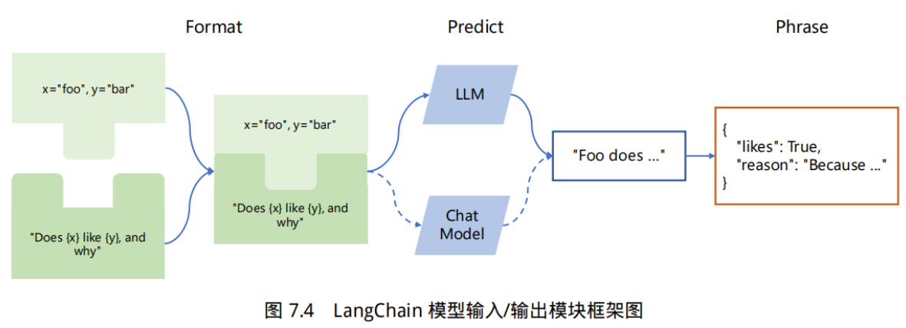
-   **数据连接（Data connection）**：与特定应用程序的数据进行交互的接口

    大模型的知识来源于其训练数据集，没有用户的信息也没有最新发生时事的信息。通过与数据库的连接，可以实现让大模型在训练数据集的基础上利用自由数据中的信息来回答问题。

    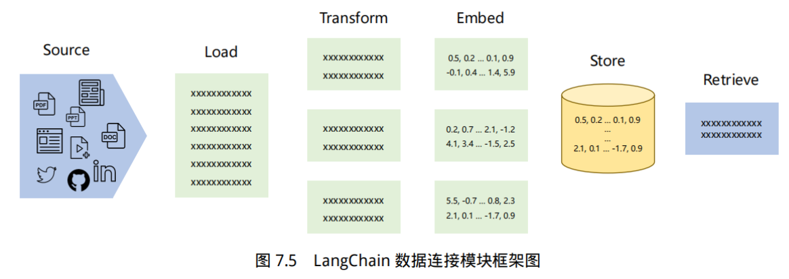
-   **链（Chains）**：将组件组合实现端到端应用

    对于复杂的需求，可能需要将多个大模型进行链式组合，或与其他组件进行链式调用，实现创建一个连贯的应用程序。
-   **记忆（Memory）**：指的是大模型的短期记忆，用于链的多次运行之间持久化应用程序状态

    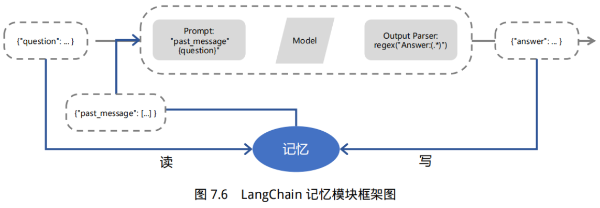
-   **代理（Agents）**：提供计算、逻辑、检索等功能的支持，使语言模型获得异常强大的推理和获取信息的超能力，进而扩展模型的推理能力。

    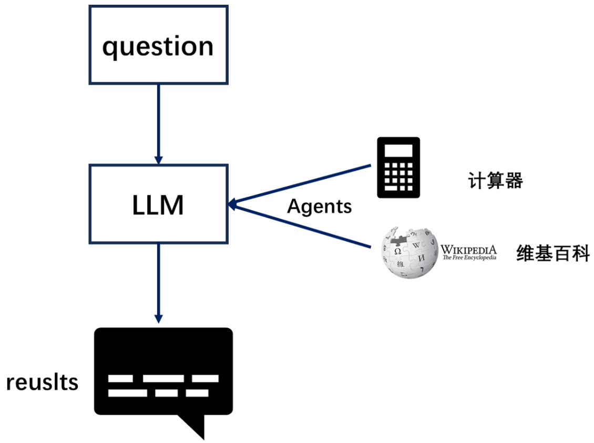
-   **回调（Callbacks）**：Langchain提供了一个回调系统，允许连接到LLM应用程序的各个阶段，可用于分析应用的运行情况，统计异常率，并识别运行中的瓶颈模块以进行优化。也就是说回调功能扮演了一个记录整个流程运行情况的角色，相当于日志的功能。
