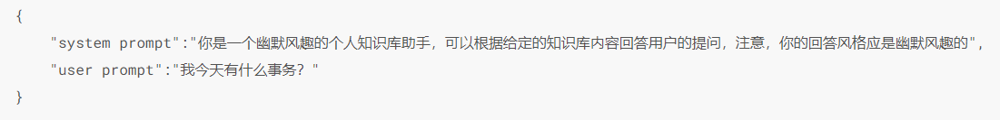

# 02 调用大模型API

## 1.基本概念

-   Prompt

    Prompt，也就是 **提示，** 就按其字面理解，它就是伴随着输入一起，给予模型的一种上下文，来指导模型接下来应该怎么做。

    Prompt技巧公式：prompt = (角色) + 任务 + 要求 + 提示
-   模型参数

    **Temperature**：LLM生成是具有随机性的，一般通过控制 Temprature 参数来控制 LLM 生成结果的随机性与创造性。简单来说，`temperature` 的参数值越小，模型就会返回越确定的一个结果。如果调高该参数值，大语言模型可能会返回更随机的结果，也就是说这可能会带来更多样化或更具创造性的产出。在实际应用方面，对于质量保障（QA）等任务，可以设置更低的 `temperature` 值，促使模型基于事实返回更真实和简洁的结果。 对于诗歌生成或其他创造性任务，可以适当调高 `temperature` 参数值。temperature的值在0\~1之间，一般默认为0.5。

    **Top\_p**：用来控制模型返回结果的真实性。如果需要准确和事实的答案，就把参数值调低。如果想要更多样化的答案，就把参数值调高一些。一般取值范围为0\~1，默认为1.0。

    Temperature和Top\_p一般只改变其中一个参数，不用两个都调整。
-   System Prompt

    System Prompt 属于开发者对大语言模型的「人设洗脑」，该Prompt 内容会在整个会话过程中持久地影响模型的回复。一般设置 System Prompt 来对模型进行一些初始化设定，在一个会话中一般只需要构造一个。

    另外还有User Prompt，是更偏向于我们平时使用的Prompt，也就是需要模型做出回复的输入。

    例子：

    

## 2.学习环境配置

Anaconda是一个安装、管理python相关包的软件，自带python、Jupyter Notebook、Spyder，并且有管理包的conda工具。

首先安装anaconda，可以参考如下链接：[https://zhuanlan.zhihu.com/p/647523947](https://zhuanlan.zhihu.com/p/647523947 "https://zhuanlan.zhihu.com/p/647523947")

安装好anaconda后，

第一步，为大模型任务创建一个名为`LLM-Langchain`新开发环境：

`conda create --name LLM-Langchain python=3.8`

第二步，切换环境到`LLM-Langchain`：

`conda activate LLM-Langchain`

第三步，安装大模型任务所需要的依赖包，这里我直接通过项目给的requirements.txt文件来安装，将执行目录指定到requirements.txt：

`D:\ProgramData\Anaconda3\envs\LLM-Langchain\python.exe -m pip install -r requirements.txt`

-   安装过程中出现的问题：
    1.  有的包需要python≥3.9的版本，建议使用python3.10
    2.  uvloop包不支持windows，在安装依赖包时，先将其屏蔽掉，后边需要使用到该包的一些功能时，找其他包替代。
    3.  在安装过程中，直接使用pip install -r requirements.txt命令安装依赖包，会报以下错误：
        ```python
        ERROR: To modify pip, please run the following command:
        D:\ProgramData\Anaconda3\envs\LLM-Langchain\python.exe -m pip install -r requirements.txt

        ```
        这个错误提示是在提醒你使用指定环境下的 Python 解释器来安装 requirements.txt 文件中的依赖项。在这个例子中，你的环境路径是 `D:\ProgramData\Anaconda3\envs\LLM-Langchain`。

        解决办法是运行下面的命令来安装 requirements.txt 文件中的依赖项：

        `D:\ProgramData\Anaconda3\envs\LLM-Langchain\python.exe -m pip install -r requirements.txt`

## 3.API调用

-   ChatGPT

    按照学习文档的流程，测试接口是否可以调用，会报如下错误：
    ```python
    openai.error.APIConnectionError: Error communicating with OpenAI: HTTPSConnectionPool(host=' api.openai.com ', port=443): Max retries exceeded with url: /v1/chat/completions (Caused by ProxyError('Unable to connect to proxy', NewConnectionError('<urllib3.connection.HTTPSConnection object at 0x0000022B6C73A6B0>: Failed to establish a new connection: [WinError 10061] 由于目标计算机积极拒绝，无法连接。')))
    ```
    根据如下方法，配置成功了[https://blog.csdn.net/as23751782/article/details/130143726](https://blog.csdn.net/as23751782/article/details/130143726 "https://blog.csdn.net/as23751782/article/details/130143726")

    但是仍报错如下：这个报错提示我“您超过了当前配额，请检查您的计划和账单详细信息。”

    openai.error.RateLimitError: You exceeded your current quota, please check your plan and billing details.

    也就是我已经使用完了所有免费Token或者注册超过三个月，不能再使用免费Token。
-   文心一言

    按照教程，首先获取API\_Key和Secret\_Key，然后基于这两个key去获取access\_token值，基于 access\_token 即可调用百度文心大模型。

    常用参数：
    ```python
    messages，即调用的 Prompt。文心的 messages 配置与 ChatGPT 有一定区别，其不支持 max_token 参数，由模型自行控制最大 token 数，content 总长度不能超过11200字符，否则模型就会自行对前文依次遗忘。文心的 messages 有以下几点要求：① 一个成员为单轮对话，多个成员为多轮对话；② 最后一个 message 为当前对话，前面的 message 为历史对话；③ 必须为奇数个对象，message 中的 role 必须依次是 user、assistant。
    stream，是否使用流式传输。
    temperature：温度系数，默认0.95，文心的 temperature 参数要求范围在0~1之间，不能设置为0。

    ```
    这个在调用API的过程中，调用几次就达到收费限制， 由于是后付费，建议先开通收费，

    这是千帆大模型平台文档：[https://cloud.baidu.com/doc/WENXINWORKSHOP/index.html](https://cloud.baidu.com/doc/WENXINWORKSHOP/index.html "https://cloud.baidu.com/doc/WENXINWORKSHOP/index.html")

    下面是关于ERNIE-Bot 4.0、ERNIE-Bot、ERNIE-Bot-turbo的使用文档：

    ERNIE-Bot 4.0：[https://cloud.baidu.com/doc/WENXINWORKSHOP/s/clntwmv7t](https://cloud.baidu.com/doc/WENXINWORKSHOP/s/clntwmv7t "https://cloud.baidu.com/doc/WENXINWORKSHOP/s/clntwmv7t")

    ERNIE-Bot：[https://cloud.baidu.com/doc/WENXINWORKSHOP/s/jlil56u11](https://cloud.baidu.com/doc/WENXINWORKSHOP/s/jlil56u11 "https://cloud.baidu.com/doc/WENXINWORKSHOP/s/jlil56u11")

    ERNIE-Bot-turbo：[https://cloud.baidu.com/doc/WENXINWORKSHOP/s/4lilb2lpf](https://cloud.baidu.com/doc/WENXINWORKSHOP/s/4lilb2lpf "https://cloud.baidu.com/doc/WENXINWORKSHOP/s/4lilb2lpf")
-   讯飞星火

    星火 API 需要通过 WebSocket 进行连接，相对来说配置较为复杂，这里暂时没配置，后续有时间再研究。916653
-   智谱GLM

    按照开发手册中的流程，注册调用都很容易。
