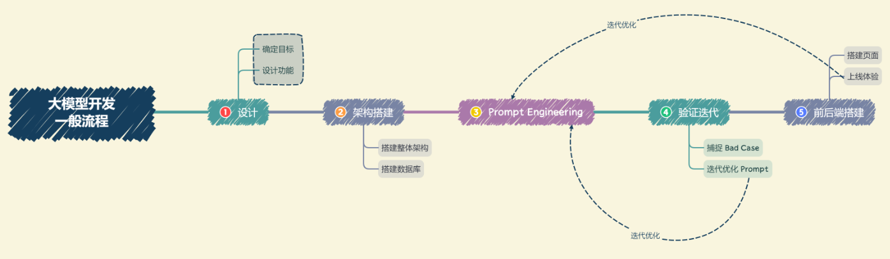

# 03 大模型开发流程及架构

## 目录

-   [1.大模型开发流程](#1大模型开发流程)
-   [2.项目流程简析](#2项目流程简析)
    -   [步骤一：项目规划与需求分析](#步骤一项目规划与需求分析)
        -   [1.项目目标：基于个人知识库的问答助手](#1项目目标基于个人知识库的问答助手)
        -   [2.核心功能](#2核心功能)
        -   [3.确定技术架构和工具](#3确定技术架构和工具)
    -   [步骤二：数据准备与向量知识库构建](#步骤二数据准备与向量知识库构建)
        -   [1. 收集和整理用户提供的文档。](#1-收集和整理用户提供的文档)
        -   [2. 将文档词向量化](#2-将文档词向量化)
        -   [3. 将向量化后的文档导入Chroma知识库，建立知识库索引。](#3-将向量化后的文档导入Chroma知识库建立知识库索引)
    -   [步骤三：大模型集成与API连接](#步骤三大模型集成与API连接)
    -   [步骤四：核心功能实现](#步骤四核心功能实现)
    -   [步骤五：核心功能迭代优化](#步骤五核心功能迭代优化)
    -   [步骤六：前端与用户交互界面开发](#步骤六前端与用户交互界面开发)
    -   [步骤七：部署测试与上线](#步骤七部署测试与上线)
    -   [步骤八：维护与持续改进](#步骤八维护与持续改进)
-   [3.项目架构简析](#3项目架构简析)
    -   [1.整体架构](#1整体架构)
    -   [2.代码结构](#2代码结构)
    -   [3.项目逻辑（这一部分在后续开发项目过程中会继续整理）](#3项目逻辑这一部分在后续开发项目过程中会继续整理)
    -   [4.各层分析](#4各层分析)
        -   [LLM层](#LLM层)
        -   [数据层](#数据层)
        -   [数据库层](#数据库层)
        -   [应用层](#应用层)
        -   [服务层](#服务层)

## 1.大模型开发流程

大模型的开发流程大致分为以下几步：

1.  确定目标。首先确定要开发的目标，先设定最小化目标，从构建一个最小可行性产品开始，逐步进行完善和优化。
2.  设计功能。确定开发目标后，需要设计本应用要提供的功能，和每个功能的大体实现逻辑。
3.  搭建整体架构。绝大部分大模型应用都是采用的特定数据库+ Prompt + 通用大模型的架构。我们需要针对我们所设计的功能，搭建项目的整体架构，实现从用户输入到应用输出的全流程贯通。
4.  搭建数据库。个性化大模型应用需要有个性化数据库进行支撑。在这一步，我们需要收集数据并进行预处理，再向量化存储到数据库中。
5.  Prompt Engineering。优质的 Prompt 对大模型能力具有极大影响，我们需要逐步迭代构建优质的 Prompt Engineering 来提升应用性能。在该步中，我们首先明确 Prompt 设计的一般原则及技巧，构建出一个来源于实际业务的小型验证集，基于小型验证集设计满足基本要求、具备基本能力的 Prompt。
6.  验证迭代。通过不断发现 Bad Case 并针对性改进 Prompt Engineering 来提升系统效果、应对边界情况。不断迭代优化，直到达到已给较为稳定、可以基本实现目标的Prompt版本。
7.  前后端搭建。
8.  体验优化。

## 2.项目流程简析

结合此次实践项目，简析整个项目流程：

### 步骤一：项目规划与需求分析

#### 1.**项目目标**：基于个人知识库的问答助手

#### 2.核心功能

1.  上传文档、创建知识库；
2.  选择知识库，检索用户提问的知识片段；
3.  提供知识片段与提问，获取大模型回答；
4.  流式回复；
5.  历史对话记录

#### 3.确定技术架构和工具

1.  LangChain框架
2.  Chroma知识库
3.  大模型使用 GPT、科大讯飞的星火大模型、文心一言、GLM 等
4.  前后端使用 Gradio 和 Streamlit。

### 步骤二：数据准备与向量知识库构建

本项目实现原理如下图所示，过程包括加载本地文档 -> 读取文本 -> 文本分割 -> 文本向量化 -> question向量化 -> 在文本向量中匹配出与问句向量最相似的 top k个 -> 匹配出的文本作为上下文和问题一起添加到 prompt中 -> 提交给 LLM生成回答。

#### 1. 收集和整理用户提供的文档。

用户常用文档格式有 pdf、txt、doc 等，首先使用工具读取文本，通常使用 langchain 的文档加载器模块可以方便的将用户提供的文档加载进来，也可以使用一些 python 比较成熟的包进行读取。

由于目前大模型使用 token 的限制，我们需要对读取的文本进行切分，将较长的文本切分为较小的文本，这时一段文本就是一个单位的知识。

#### 2. 将文档词向量化

使用文本嵌入(Embeddings)对分割后的文档进行向量化，使语义相似的文本片段具有接近的向量表示。然后，存入向量数据库，这个流程正是创建 `索引(index)` 的过程。

向量数据库对各文档片段进行索引，支持快速检索。这样，当用户提出问题时，可以先将问题转换为向量，在数据库中快速找到语义最相关的文档片段。然后将这些文档片段与问题一起传递给语言模型，生成回答

#### 3. 将向量化后的文档导入Chroma知识库，建立知识库索引。

Langchain 集成了超过 30 个不同的向量存储库。我们选择 Chroma 向量库是因为它轻量级且数据存储在内存中，这使得它非常容易启动和开始使用。

将用户知识库内容经过 embedding 存入向量知识库，然后用户每一次提问也会经过 embedding，利用向量相关性算法（例如余弦算法）找到最匹配的几个知识库片段，将这些知识库片段作为上下文，与用户问题一起作为 prompt 提交给 LLM 回答。

### 步骤三：大模型集成与API连接

1.  集成GPT、星火、文心、GLM 等大模型，配置 API 连接。
2.  编写代码，实现与大模型 API 的交互，以便获取问题答案。

### 步骤四：核心功能实现

1.  构建 Prompt Engineering，实现大模型回答功能，根据用户提问和知识库内容生成回答。
2.  实现流式回复，允许用户进行多轮对话。
3.  添加历史对话记录功能，保存用户与助手的交互历史。

### 步骤五：核心功能迭代优化

1.  进行验证评估，收集 Bad Case。
2.  根据 Bad Case 迭代优化核心功能实现。

### 步骤六：前端与用户交互界面开发

1.  使用 Gradio 和 Streamlit 搭建前端界面。
2.  实现用户上传文档、创建知识库的功能。
3.  设计用户界面，包括问题输入、知识库选择、历史记录展示等。

### 步骤七：部署测试与上线

1.  部署问答助手到服务器或云平台，确保可在互联网上访问。
2.  进行生产环境测试，确保系统稳定。
3.  上线并向用户发布。

### 步骤八：维护与持续改进

1.  监测系统性能和用户反馈，及时处理问题。
2.  定期更新知识库，添加新的文档和信息。
3.  收集用户需求，进行系统改进和功能扩展。

## 3.项目架构简析

### 1.整体架构

项目从底向上分为LLM层、数据层、数据库层、应用层与服务层。

1.  LLM层主要是对大模型 API调用封装，支持用户以统一的入口、方式来访问不同大模型；
2.  数据层主要包括个人知识库的源数据以及 Embedding API，其中源数据经过 Embedding 处理可以被向量数据库使用；
3.  数据库层主要为基于个人知识库源数据搭建的向量数据库，在本项目中选择使用Chroma；
4.  应用层为核心功能的最顶层封装，基于 LangChain 提供的检索问答链基类进行了进一步封装，从而支持不同模型切换以及便捷实现基于数据库的检索问答；
5.  服务层则分别实现了基于 Gradio 搭建 Demo 与 FastAPI 组建 API 两种方式来支持本项目的服务访问。

### 2.代码结构

### 3.项目逻辑（这一部分在后续开发项目过程中会继续整理）

1.  用户：可以通过 run\_gradio 或者 run\_api 启动整个服务；
2.  服务层调用 qa\_chain.py 或 chat\_qa\_chain 实例化对话检索链对象，实现全部核心功能；
3.  服务层和应用层都可以调用、切换 prompt\_template.py 中的 prompt 模板来实现 prompt 的迭代；
4.  也可以直接调用 call\_llm 中的 get\_completion 函数来实现不使用数据库的 LLM；
5.  应用层调用已存在的数据库和 llm 中的自定义 LLM 来构建检索链；
6.  如果数据库不存在，应用层调用 create\_db.py 创建数据库，该脚本可以使用 openai embedding 也可以使用 [embedding.py](http://embedding.py "embedding.py") 中的自定义 embedding

### 4.各层分析

#### LLM层

主要是对大模型 API调用封装，实现在同一个对象或函数中通过不同的 model 参数来使用不同来源的 LLM。

实现流程如下：

首先构建一个 Self\_LLM 基类，基类定义了所有 API 的一些共同参数（如 API\_Key，temperature 等）；

然后在该基类基础上继承实现了上述主流 LLM API 的自定义 LLM；

同时，将 LLM 的原生 API 封装在了统一的 get\_completion 函数中。

#### 数据层

数据层主要包括个人知识库的源数据（包括 pdf、txt、md 等）和 Embedding 对象。

源数据需要经过 Embedding 处理才能进入向量数据库，在数据层自定义了智谱提供的 Embedding API 的封装，支持上层以统一方式调用智谱 Embedding 或 OpenAI Embedding。

#### 数据库层

数据库层主要存放了向量数据库文件。同时，在该层实现了源数据处理、创建向量数据库的方法。

#### 应用层

应用层封装了整个项目的全部核心功能。

基于 LangChain 提供的检索问答链，在 LLM 层、数据库层的基础上，实现了本项目检索问答链的封装。自定义的检索问答链除具备基本的检索问答功能外，也支持通过 model 参数来灵活切换使用的 LLM。这里实现了两个检索问答链，分别是有历史记录的 Chat\_QA\_Chain 和没有历史记录的 QA\_Chain。

#### 服务层

服务层主要是基于应用层的核心功能封装，实现了 Demo 的搭建或 API 的封装。本项目基于 Gradio 搭建 Demo 与 FastAPI 组建 API 两种方式来支持本项目的服务访问。
