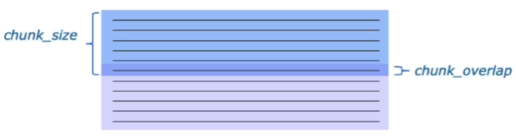

# 04 数据库搭建

## 目录

-   [1.知识库文档处理](#1知识库文档处理)
    -   [知识库设计](#知识库设计)
    -   [文档加载](#文档加载)
    -   [文档分割](#文档分割)
    -   [文档词向量化](#文档词向量化)
-   [2.向量数据库的介绍及使用](#2向量数据库的介绍及使用)
    -   [向量数据库介绍](#向量数据库介绍)
    -   [Chroma向量库构建](#Chroma向量库构建)
    -   [向量数据库检索](#向量数据库检索)
    -   [构造检索问答链](#构造检索问答链)
-   [3.构建项目数据库](#3构建项目数据库)

## 1.知识库文档处理

### 知识库设计

知识库选取了Datawhale的一些经典开源课程、视频等。

### 文档加载

-   PDF文档

    使用PyMuPDFLoader来读取知识库的PDF文件。返回结果包含 PDF 及其页面的详细元数据，并且每页返回一个文档。
-   MD文档

    使用langchain.document\_loaders下面的UnstructuredMarkdownLoader函数来读取MD文件。返回结果包含 PDF 及其页面的详细元数据，并且每页返回一个文档。
-   MP4视频

    LangChain 提供了对 Youtube 视频进行爬取并转写的处理接口，如果想对本地MP4视频进行处理，需要先使用Whisper实现视频的转录为txt格式，再加载到Langchain中。

    使用langchain.document\_loaders下面的UnstructuredFileLoader函数来读取txt文件。

### 文档分割

文档分割使用Langchain中的文本分割器，根据`chunk_size` (块大小)和 `chunk_overlap` (块与块之间的重叠大小)进行分割。



-   chunk\_size 指每个块包含的字符或 Token （如单词、句子等）的数量
-   chunk\_overlap 指两个块之间共享的字符数量，用于保持上下文的连贯性，避免分割丢失上下文信息

Langchain根据怎么确定块与块之间的边界、块由哪些字符/token组成、如何测量块大小等提供多种文档分割方式。

### 文档词向量化

Embedding是将数据转化为实数向量的技术，其思想是相似或相关的对象在嵌入空间中的距离应该很近。

embedding的方式一种是直接使用 openai 的模型生成 embedding，另一种是使用 HuggingFace 上的模型去生成 embedding。

-   openAI 的模型需要消耗 api，对于大量的token 来说成本会比较高，但是非常方便。
-   HuggingFace 的模型可以本地部署，可自定义合适的模型，可玩性较高，但对本地的资源有部分要求。

## 2.向量数据库的介绍及使用

### 向量数据库介绍

向量数据库是一种专门用于存储和检索向量数据（embedding）的数据库系统，与传统的基于关系模型的数据库不同，它主要关注的是向量数据的特性和相似性。

向量数据库中，数据被表示为向量形式，每个向量代表一个数据项。Langchain集成了30多个不同的向量存储库，本项目选用轻量级向量数据库Chroma。

### Chroma向量库构建

可以使用`vectordb = Chroma.from_documents`构建，然后使用`vectordb.persist()`持久化保存向量数据库

### 向量数据库检索

-   相似度检索
    ```python
    question="什么是机器学习"
    sim_docs = vectordb.similarity_search(question,k=3)

    ```
    根据相似度，检索3个相关内容数。
-   MMR检索
    ```python
    mmr_docs = vectordb.max_marginal_relevance_search(question,k=3)
    ```
    如果只考虑检索出内容的相关性会导致内容过于单一，可能会损失一些重要信息。

    MMR最大边际相关性，其核心思想是在已经选择了一个相关性高的文档之后，再选择一个与已选文档相关性较低但是信息丰富的文档。可以在保持相关性的同时，增加内容的丰富度。

### 构造检索问答链

-   直接询问LLM
    ```python
    llm = ZhipuAILLM(model="chatglm_std", temperature=0)
    # 声明一个检索式问答链
    qa_chain = RetrievalQA.from_chain_type(llm,retriever=vectordb.as_retriever())
    # 可以以该方式进行检索问答
    question = "本知识库主要包含什么内容"
    result = qa_chain({"query": question})
    print(f"大语言模型的回答为：{result['result']}")
    ```
-   结合prompt提问

    首先定义一个提示模板，其包含一些关于如何使用下面的上下文片段的说明，然后有一个上下文变量的占位符。
    ```python
    from langchain.prompts import PromptTemplate

    # Build prompt
    template = """使用以下上下文片段来回答最后的问题。如果你不知道答案，只需说不知道，不要试图编造答案。答案最多使用三个句子。尽量简明扼要地回答。在回答的最后一定要说"感谢您的提问！"
    {context}
    问题：{question}
    有用的回答："""
    QA_CHAIN_PROMPT = PromptTemplate.from_template(template)

    # Run chain
    qa_chain = RetrievalQA.from_chain_type(llm,retriever=vectordb.as_retriever(),return_source_documents=True,chain_type_kwargs={"prompt": QA_CHAIN_PROMPT})
    question = " 2025 年大语言模型效果最好的是哪个模型"
    result = qa_chain({"query": question})
    print(f"LLM 对问题的回答：{result['result']}")
    ```

## 3.构建项目数据库

见例程。
