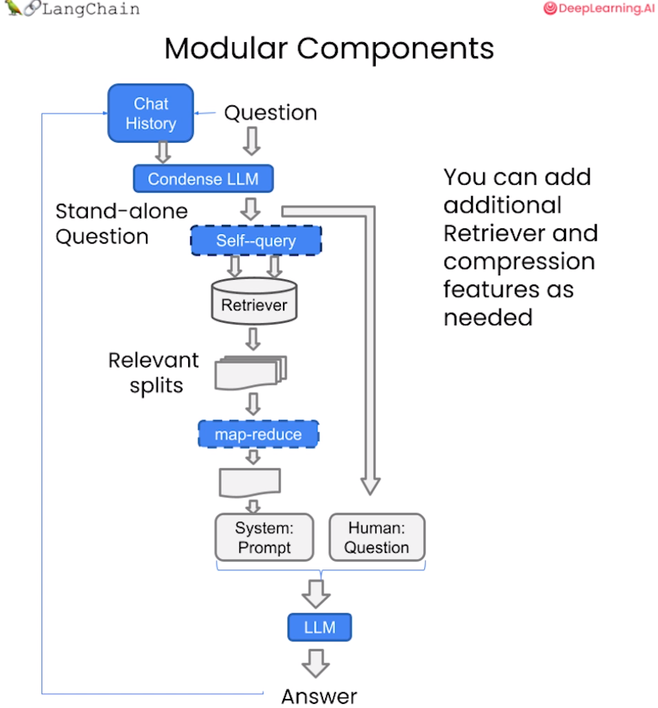

# 05 Prompt设计

## 目录

-   [1.Prompt设计的原则和技巧](#1Prompt设计的原则和技巧)
    -   [清晰具体的指令](#清晰具体的指令)
    -   [给模型时间思考](#给模型时间思考)
-   [2.基于问答助手的Prompt搭建](#2基于问答助手的Prompt搭建)
-   [3.添加历史对话的记忆功能](#3添加历史对话的记忆功能)
    -   [记忆Memory](#记忆Memory)
    -   [对话检索链](#对话检索链)

## 1.Prompt设计的原则和技巧

### 清晰具体的指令

1.  使用分隔符清晰表示输入的不同部分

    使用各种标点符号作为“分隔符”，将不同的文本部分区分开来。

    这里注意，使用分隔符要防止**提示词注入**问题。也就是用户输入的文本可能包含与预设prompt相冲突的内容，如果不加分隔符，可这些输入就可能“注入”并操作语言模型。
2.  结构化输出

    让模型按照某种格式（例如JSON、HTML等）返回给我们。例：
    ```text
    prompt = f"""
    请生成包括书名、作者和类别的三本虚构的、非真实存在的中文书籍清单，\
    并以 JSON 格式提供，其中包含以下键:book_id、title、author、genre。
    """
    ```
3.  要求模型检查是否满足条件

    如果任务包含不一定能满足的假设（条件），我们可以告诉模型先检查这些假设，如果不满足，则会指出并停止执行后续的完整流程。
4.  提供少量示例

    在要求模型执行实际任务之前，给模型一两个已完成的样例，让模型了解我们的要求和期望的输出样式。

### 给模型时间思考

设计prompt时，通过prompt引导模型深入思考非常重要，就像人需要时间来思考并解决复杂问题一样。

1.  指定完成任务所需的步骤
2.  指导模型在下结论之前找出一个自己的解法

    对于数学等复杂问题，设计Prompt时，先要求语言模型自己尝试解决这个问题，思考出自己的解法，然后再与提供的解答进行对比，判断答案正确性。

## 2.基于问答助手的Prompt搭建

前面的章节，我们已经根据自己的本地知识文档，搭建了一个向量数据库。现在我们可以使用搭建好的向量数据库，对query查询问题进行召回，然后将召回结果和 query 结合起来构建 prompt，输入到大模型中进行问答。步骤如下：

1.  加载向量数据库
2.  创建一个LLM
3.  构建prompt
4.  prompt效果测试

LLM不能很好的回答非常识专业问题以及知识不在LLM训练数据集中的问题，通过引入本地知识，可以有效地缓解该问题，并且也有助于缓解大模型的“幻觉”问题。

## 3.添加历史对话的记忆功能

通过本地知识库与问题结合，可以让大模型回答得到一个更为理想的结果。现在还有**大模型不记得之前的交流内容**这一关键问题没有解决。在该项目中主要通过Langchain中的Memory模型来解决。

### 记忆Memory

根据langchain.memory中的ConversationBufferMemory模块，可以实现保存聊天消息历史记录的列表，这些历史记录将在回答问题时与问题一起传递给聊天机器人，从而将它们添加到上下文中。

```python
from langchain.memory import ConversationBufferMemory
memory = ConversationBufferMemory(
    memory_key="chat_history",  # 与 prompt 的输入变量保持一致。
    return_messages=True  # 将以消息列表的形式返回聊天记录，而不是单个字符串
)
```

### 对话检索链

对话检索链（ConversationalRetrievalChain）在检索 QA 链的基础上，增加了处理对话历史的能力。

```python
from langchain.chains import ConversationalRetrievalChain

retriever=vectordb.as_retriever()
qa = ConversationalRetrievalChain.from_llm(
    llm,
    retriever=retriever,
    memory=memory
)
question = "我可以学习到关于强化学习的知识吗？"
result = qa({"question": question})
print(result['answer'])
```

工作流程如下:

1.  将之前的对话与新问题合并生成一个完整的查询语句。
2.  在向量数据库中搜索该查询的相关文档。
3.  获取结果后,存储所有答案到对话记忆区。
4.  用户可在 UI 中查看完整的对话流程。


