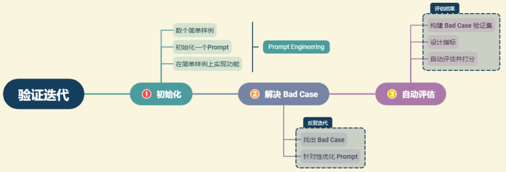

# 06 验证迭代

## 目录

-   [1.验证迭代的一般思路](#1验证迭代的一般思路)
-   [2.解决Bad Case](#2解决Bad-Case)
-   [3.大模型评估方法](#3大模型评估方法)
    -   [人工评估的一般思路](#人工评估的一般思路)
    -   [简单自动评估](#简单自动评估)
    -   [使用大模型评估](#使用大模型评估)
    -   [混合评估](#混合评估)

## 1.验证迭代的一般思路



首先，在一到三个样本的小样本中调整 Prompt ，尝试使其在这些样本上起效。随后，在对系统进行进一步测试时，可能会遇到一些棘手的例子，这些例子无法通过 Prompt 或者算法解决。这就是使用 LLM 构建应用程序的开发者所面临的挑战。在这种情况下，将这些额外的几个例子添加到正在测试的集合中，有机地添加其他难以处理的例子。最终，会将足够多的这些例子添加到逐步扩大的开发集中，以至于手动运行每一个例子以测试 Prompt 变得有些不便。然后，开始开发一些用于衡量这些小样本集性能的指标，例如平均准确度。

## 2.解决Bad Case

这一节结合项目，整理了优化prompt来解决Bad Case的思路。

1.  构造向量数据库，使用初始化的prompt构建一个基于模板的检索链。
2.  评估直观回答的质量，结合原有资料内容，判断在什么方面有所不足，再针对性修改Prompt模板。
3.  标明知识来源，提高可信度。（该方式往往会导致上下文的增加及回复速度降低，实际应用时，需要根据业务场景酌情考虑）
4.  构造思维链，将prompt构造成一系列步骤来缓解大模型的幻觉、无法理解较为复杂的指令、无法执行复杂步骤等问题。
5.  我们往往需要模型以指定的格式进行输出，但是由于使用prompt Template 来填充用户问题，用户问题中存在的格式要求往往会被忽略。这时可以在我们的检索 LLM 之前，增加一层 LLM 来实现指令的解析，将用户问题的格式要求和问题内容拆分开来。
    ```python
    question = 'LLM的分类是什么？给我返回一个 Python List'
    # 首先将格式要求与问题拆分
    input_lst_s = get_completion(prompt_input.format(question))
    rule, new_question = eval(input_lst_s)
    # 接着使用拆分后的问题调用检索链
    result = qa_chain({"query": new_question})
    result_context = result["result"]
    # 接着调用输出格式解析
    response = get_completion(prompt_output.format(new_question, result_context, rule))

    ```

## 3.大模型评估方法

对于小数据集，我们可以通过人工评估的方式，评估系统输出的优劣，但随着数据集随着系统的优化不断扩张，人工评估的时间和人力成本已经无法被接受，于是需要采用自动评估的方法。下面介绍大模型评估的方法。

### 人工评估的一般思路

-   量化评估。可以通过给每个答案赋予 1\~5 的打分的方式来评估。
-   多维评估。例如：可以在知识查找正确性、回答一致性、回答幻觉比例、回答正确性、逻辑性、通顺性、智能性等多个角度分别评分。

### 简单自动评估

对于难以自动评估大模型生成答案的问题，可以通过将复杂没有标准答案的主观题转化为有标准的答案的客观题，或者构造一个标准答案计算标准答案相似度的方式来解决。

-   构造客观题
-   计算标准答案相似度（可以使用BLEU相似度）

### 使用大模型评估

人工评估准确度高、全面性强，但人力成本与时间成本高；自动评估成本低、评估速度快，但存在准确性不足、评估不够全面。

对于这两者存在的问题，我们可以使用大模型进行评估，通过构造 Prompt Engineering 让大模型充当一个评估者的角色，从而替代人工评估的评估员；同时大模型可以给出类似于人工评估的结果，因此可以采取人工评估中的多维度量化评估的方式，实现快速全面的评估。

例：

```python
prompt = '''
你是一个模型回答评估员。
接下来，我将给你一个问题、对应的知识片段以及模型根据知识片段对问题的回答。
请你依次评估以下维度模型回答的表现，分别给出打分：
① 知识查找正确性。评估系统给定的知识片段是否能够对问题做出回答。如果知识片段不能做出回答，打分为0；如果知识片段可以做出回答，打分为1。
② 回答一致性。评估系统的回答是否针对用户问题展开，是否有偏题、错误理解题意的情况，打分分值在0~1之间，0为完全偏题，1为完全切题。
③ 回答幻觉比例。该维度需要综合系统回答与查找到的知识片段，评估系统的回答是否出现幻觉，打分分值在0~1之间,0为全部是模型幻觉，1为没有任何幻觉。
④ 回答正确性。该维度评估系统回答是否正确，是否充分解答了用户问题，打分分值在0~1之间，0为完全不正确，1为完全正确。
⑤ 逻辑性。该维度评估系统回答是否逻辑连贯，是否出现前后冲突、逻辑混乱的情况。打分分值在0~1之间，0为逻辑完全混乱，1为完全没有逻辑问题。
⑥ 通顺性。该维度评估系统回答是否通顺、合乎语法。打分分值在0~1之间，0为语句完全不通顺，1为语句完全通顺没有任何语法问题。
⑦ 智能性。该维度评估系统回答是否拟人化、智能化，是否能充分让用户混淆人工回答与智能回答。打分分值在0~1之间，0为非常明显的模型回答，1为与人工回答高度一致。
你应该是比较严苛的评估员，很少给出满分的高评估。
用户问题：{}
待评估的回答：{}
给定的知识片段：{}
你应该返回给我一个可直接解析的 Python 字典，字典的键是如上维度，值是每一个维度对应的评估打分。
不要输出任何其他内容。
'''

```

在此基础上，还可以通过迭代优化 Prompt Engineering、拆分评估维度、合并评估维度、提供详细的评估规范、提供少量示例等方式，来提高大模型评估表现。

### 混合评估

将多种评估方法混合起来，对于每一种维度选取其适合的评估方法，兼顾评估的全面、准确和高效。

1.  客观正确性。客观正确性指对于一些有固定正确答案的问题，模型可以给出正确的回答。我们可以选取部分案例，使用构造客观题的方式来进行模型评估，评估其客观正确性。
2.  主观正确性。主观正确性指对于没有固定正确答案的主观问题，模型可以给出正确的、全面的回答。我们可以选取部分案例，使用大模型评估的方式来评估模型回答是否正确。
3.  智能性。智能性指模型的回答是否足够拟人化。由于智能性与问题本身弱相关，与模型、Prompt 强相关，且模型判断智能性能力较弱，我们可以少量抽样进行人工评估其智能性。
4.  知识查找正确性。知识查找正确性指对于特定问题，从知识库检索到的知识片段是否正确、是否足够回答问题。知识查找正确性推荐使用大模型进行评估，即要求模型判别给定的知识片段是否足够回答问题。同时，该维度评估结果结合主观正确性可以计算幻觉情况，即如果主观回答正确但知识查找不正确，则说明产生了模型幻觉。
